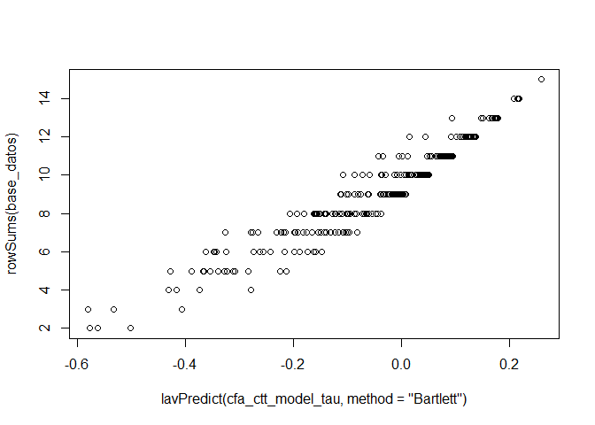
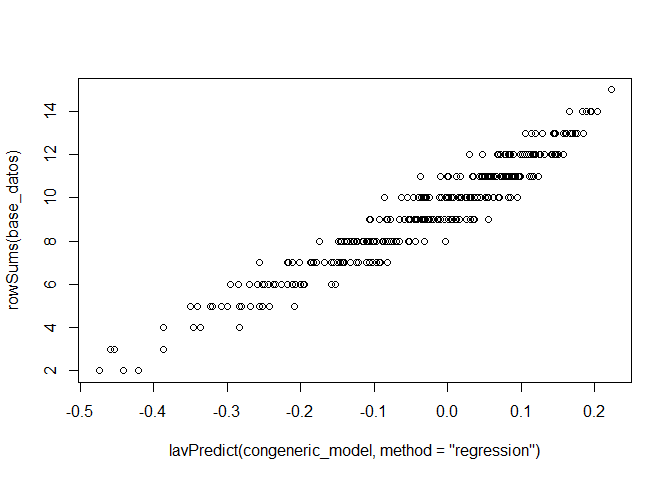

Análisis Psicométricos
================

``` r
pacman::p_load(tidyverse, mirt, corrplot,assertr,sjPlot, lavaan)
```

Simulación de datos
-------------------

Vamos a hacer análisis de ítems de una prueba que suponemos mide una sola dimensión. Esto es, que hay solo un atributo psicológico que genera el patrón de respuestas observado (o que induce la covariación entre ítems).

Vamos a generar ítems de fácil, media y alta dificultad.

``` r
betas = matrix(c(1,1.3,1.8,2,2.1, # ítems fáciles
          0,0.3,0.5,-0.5,-0.8,  #  ítems medios
          -1,-1.2,-1.5,-1.7,-1.4), ncol = 1) ## ítems difíciles

alfas = matrix(c(1.2,1.2,1.3,1.4,1.1, 
          0.8,0.9,1.1,1.3,1.5,
          0.7,0.6,0.9,1.2,1.5),ncol=1)

guess = matrix(c(0.1,0.1,0.1,0.1,0.1,
          0.15,0.15,0.15,0.15,0.15,
          0.2,0.2,0.2,0.2,0.2),ncol=1)

theta = matrix(rnorm(400, 0.5, 1),ncol=1)
```

``` r
base_datos=simdata(a=alfas,d=betas, guess = guess,itemtype = "3PL", Theta = theta)
base_datos = data.frame(base_datos)
head(base_datos)
```

    ##   Item_1 Item_2 Item_3 Item_4 Item_5 Item_6 Item_7 Item_8 Item_9 Item_10
    ## 1      1      1      1      1      1      1      1      1      1       1
    ## 2      1      1      1      0      1      0      1      1      1       1
    ## 3      1      1      1      1      1      1      0      1      0       0
    ## 4      1      1      1      1      1      0      1      1      1       1
    ## 5      1      0      1      1      1      0      1      1      1       1
    ## 6      1      1      1      1      1      0      1      1      1       1
    ##   Item_11 Item_12 Item_13 Item_14 Item_15
    ## 1       0       0       1       1       1
    ## 2       1       1       1       1       1
    ## 3       0       0       0       0       0
    ## 4       1       1       0       0       1
    ## 5       1       1       1       0       0
    ## 6       1       0       1       0       0

Descriptivos
============

Algunos datos que nos pueden interesar son los descriptivos, correlaciones ítem test y consistencia interna. Para ello, podríamos ocupar la siguiente función:

``` r
sjPlot::sjt.itemanalysis(base_datos)
```

<table style="border-collapse:collapse; border:none;">
<caption style="font-weight: bold; text-align:left;">
Component 1
</caption>
<tr>
<th style="border-top: double; text-align:center; font-style:italic; font-weight:normal; padding:0.2cm; border-bottom:1px solid black; text-align:left;text-align:left; ">
Row
</th>
<th style="border-top: double; text-align:center; font-style:italic; font-weight:normal; padding:0.2cm; border-bottom:1px solid black; ">
Missings
</th>
<th style="border-top: double; text-align:center; font-style:italic; font-weight:normal; padding:0.2cm; border-bottom:1px solid black; ">
Mean
</th>
<th style="border-top: double; text-align:center; font-style:italic; font-weight:normal; padding:0.2cm; border-bottom:1px solid black; ">
SD
</th>
<th style="border-top: double; text-align:center; font-style:italic; font-weight:normal; padding:0.2cm; border-bottom:1px solid black; ">
Skew
</th>
<th style="border-top: double; text-align:center; font-style:italic; font-weight:normal; padding:0.2cm; border-bottom:1px solid black; ">
Item Difficulty
</th>
<th style="border-top: double; text-align:center; font-style:italic; font-weight:normal; padding:0.2cm; border-bottom:1px solid black; col7">
Item Discrimination
</th>
<th style="border-top: double; text-align:center; font-style:italic; font-weight:normal; padding:0.2cm; border-bottom:1px solid black; col8">
α if deleted
</th>
</tr>
<tr>
<td style=" padding:0.2cm; text-align:left; vertical-align:top; text-align:left;text-align:left; ">
Item\_1
</td>
<td style=" padding:0.2cm; text-align:left; vertical-align:top; text-align:center; ">
0.00 %
</td>
<td style=" padding:0.2cm; text-align:left; vertical-align:top; text-align:center; ">
0.82
</td>
<td style=" padding:0.2cm; text-align:left; vertical-align:top; text-align:center; ">
0.39
</td>
<td style=" padding:0.2cm; text-align:left; vertical-align:top; text-align:center; ">
-1.64
</td>
<td style=" padding:0.2cm; text-align:left; vertical-align:top; text-align:center; ">
0.82
</td>
<td style=" padding:0.2cm; text-align:left; vertical-align:top; text-align:center; col7">
0.352
</td>
<td style=" padding:0.2cm; text-align:left; vertical-align:top; text-align:center; col8">
0.566
</td>
</tr>
<tr>
<td style=" padding:0.2cm; text-align:left; vertical-align:top; text-align:left;text-align:left; background-color:#f2f2f2; ">
Item\_2
</td>
<td style=" padding:0.2cm; text-align:left; vertical-align:top; text-align:center; background-color:#f2f2f2; ">
0.00 %
</td>
<td style=" padding:0.2cm; text-align:left; vertical-align:top; text-align:center; background-color:#f2f2f2; ">
0.84
</td>
<td style=" padding:0.2cm; text-align:left; vertical-align:top; text-align:center; background-color:#f2f2f2; ">
0.37
</td>
<td style=" padding:0.2cm; text-align:left; vertical-align:top; text-align:center; background-color:#f2f2f2; ">
-1.82
</td>
<td style=" padding:0.2cm; text-align:left; vertical-align:top; text-align:center; background-color:#f2f2f2; ">
0.84
</td>
<td style=" padding:0.2cm; text-align:left; vertical-align:top; text-align:center; background-color:#f2f2f2; col7">
0.295
</td>
<td style=" padding:0.2cm; text-align:left; vertical-align:top; text-align:center; background-color:#f2f2f2; col8">
0.576
</td>
</tr>
<tr>
<td style=" padding:0.2cm; text-align:left; vertical-align:top; text-align:left;text-align:left; ">
Item\_3
</td>
<td style=" padding:0.2cm; text-align:left; vertical-align:top; text-align:center; ">
0.00 %
</td>
<td style=" padding:0.2cm; text-align:left; vertical-align:top; text-align:center; ">
0.91
</td>
<td style=" padding:0.2cm; text-align:left; vertical-align:top; text-align:center; ">
0.29
</td>
<td style=" padding:0.2cm; text-align:left; vertical-align:top; text-align:center; ">
-2.85
</td>
<td style=" padding:0.2cm; text-align:left; vertical-align:top; text-align:center; ">
0.91
</td>
<td style=" padding:0.2cm; text-align:left; vertical-align:top; text-align:center; col7">
0.167
</td>
<td style=" padding:0.2cm; text-align:left; vertical-align:top; text-align:center; col8">
0.594
</td>
</tr>
<tr>
<td style=" padding:0.2cm; text-align:left; vertical-align:top; text-align:left;text-align:left; background-color:#f2f2f2; ">
Item\_4
</td>
<td style=" padding:0.2cm; text-align:left; vertical-align:top; text-align:center; background-color:#f2f2f2; ">
0.00 %
</td>
<td style=" padding:0.2cm; text-align:left; vertical-align:top; text-align:center; background-color:#f2f2f2; ">
0.94
</td>
<td style=" padding:0.2cm; text-align:left; vertical-align:top; text-align:center; background-color:#f2f2f2; ">
0.24
</td>
<td style=" padding:0.2cm; text-align:left; vertical-align:top; text-align:center; background-color:#f2f2f2; ">
-3.6
</td>
<td style=" padding:0.2cm; text-align:left; vertical-align:top; text-align:center; background-color:#f2f2f2; ">
0.94
</td>
<td style=" padding:0.2cm; text-align:left; vertical-align:top; text-align:center; background-color:#f2f2f2; col7">
0.192
</td>
<td style=" padding:0.2cm; text-align:left; vertical-align:top; text-align:center; background-color:#f2f2f2; col8">
0.592
</td>
</tr>
<tr>
<td style=" padding:0.2cm; text-align:left; vertical-align:top; text-align:left;text-align:left; ">
Item\_5
</td>
<td style=" padding:0.2cm; text-align:left; vertical-align:top; text-align:center; ">
0.00 %
</td>
<td style=" padding:0.2cm; text-align:left; vertical-align:top; text-align:center; ">
0.91
</td>
<td style=" padding:0.2cm; text-align:left; vertical-align:top; text-align:center; ">
0.29
</td>
<td style=" padding:0.2cm; text-align:left; vertical-align:top; text-align:center; ">
-2.85
</td>
<td style=" padding:0.2cm; text-align:left; vertical-align:top; text-align:center; ">
0.91
</td>
<td style=" padding:0.2cm; text-align:left; vertical-align:top; text-align:center; col7">
0.254
</td>
<td style=" padding:0.2cm; text-align:left; vertical-align:top; text-align:center; col8">
0.585
</td>
</tr>
<tr>
<td style=" padding:0.2cm; text-align:left; vertical-align:top; text-align:left;text-align:left; background-color:#f2f2f2; ">
Item\_6
</td>
<td style=" padding:0.2cm; text-align:left; vertical-align:top; text-align:center; background-color:#f2f2f2; ">
0.00 %
</td>
<td style=" padding:0.2cm; text-align:left; vertical-align:top; text-align:center; background-color:#f2f2f2; ">
0.63
</td>
<td style=" padding:0.2cm; text-align:left; vertical-align:top; text-align:center; background-color:#f2f2f2; ">
0.48
</td>
<td style=" padding:0.2cm; text-align:left; vertical-align:top; text-align:center; background-color:#f2f2f2; ">
-0.53
</td>
<td style=" padding:0.2cm; text-align:left; vertical-align:top; text-align:center; background-color:#f2f2f2; ">
0.63
</td>
<td style=" padding:0.2cm; text-align:left; vertical-align:top; text-align:center; background-color:#f2f2f2; col7">
0.255
</td>
<td style=" padding:0.2cm; text-align:left; vertical-align:top; text-align:center; background-color:#f2f2f2; col8">
0.58
</td>
</tr>
<tr>
<td style=" padding:0.2cm; text-align:left; vertical-align:top; text-align:left;text-align:left; ">
Item\_7
</td>
<td style=" padding:0.2cm; text-align:left; vertical-align:top; text-align:center; ">
0.00 %
</td>
<td style=" padding:0.2cm; text-align:left; vertical-align:top; text-align:center; ">
0.66
</td>
<td style=" padding:0.2cm; text-align:left; vertical-align:top; text-align:center; ">
0.47
</td>
<td style=" padding:0.2cm; text-align:left; vertical-align:top; text-align:center; ">
-0.67
</td>
<td style=" padding:0.2cm; text-align:left; vertical-align:top; text-align:center; ">
0.66
</td>
<td style=" padding:0.2cm; text-align:left; vertical-align:top; text-align:center; col7">
0.28
</td>
<td style=" padding:0.2cm; text-align:left; vertical-align:top; text-align:center; col8">
0.576
</td>
</tr>
<tr>
<td style=" padding:0.2cm; text-align:left; vertical-align:top; text-align:left;text-align:left; background-color:#f2f2f2; ">
Item\_8
</td>
<td style=" padding:0.2cm; text-align:left; vertical-align:top; text-align:center; background-color:#f2f2f2; ">
0.00 %
</td>
<td style=" padding:0.2cm; text-align:left; vertical-align:top; text-align:center; background-color:#f2f2f2; ">
0.74
</td>
<td style=" padding:0.2cm; text-align:left; vertical-align:top; text-align:center; background-color:#f2f2f2; ">
0.44
</td>
<td style=" padding:0.2cm; text-align:left; vertical-align:top; text-align:center; background-color:#f2f2f2; ">
-1.12
</td>
<td style=" padding:0.2cm; text-align:left; vertical-align:top; text-align:center; background-color:#f2f2f2; ">
0.74
</td>
<td style=" padding:0.2cm; text-align:left; vertical-align:top; text-align:center; background-color:#f2f2f2; col7">
0.362
</td>
<td style=" padding:0.2cm; text-align:left; vertical-align:top; text-align:center; background-color:#f2f2f2; col8">
0.562
</td>
</tr>
<tr>
<td style=" padding:0.2cm; text-align:left; vertical-align:top; text-align:left;text-align:left; ">
Item\_9
</td>
<td style=" padding:0.2cm; text-align:left; vertical-align:top; text-align:center; ">
0.00 %
</td>
<td style=" padding:0.2cm; text-align:left; vertical-align:top; text-align:center; ">
0.6
</td>
<td style=" padding:0.2cm; text-align:left; vertical-align:top; text-align:center; ">
0.49
</td>
<td style=" padding:0.2cm; text-align:left; vertical-align:top; text-align:center; ">
-0.4
</td>
<td style=" padding:0.2cm; text-align:left; vertical-align:top; text-align:center; ">
0.6
</td>
<td style=" padding:0.2cm; text-align:left; vertical-align:top; text-align:center; col7">
0.29
</td>
<td style=" padding:0.2cm; text-align:left; vertical-align:top; text-align:center; col8">
0.574
</td>
</tr>
<tr>
<td style=" padding:0.2cm; text-align:left; vertical-align:top; text-align:left;text-align:left; background-color:#f2f2f2; ">
Item\_10
</td>
<td style=" padding:0.2cm; text-align:left; vertical-align:top; text-align:center; background-color:#f2f2f2; ">
0.00 %
</td>
<td style=" padding:0.2cm; text-align:left; vertical-align:top; text-align:center; background-color:#f2f2f2; ">
0.6
</td>
<td style=" padding:0.2cm; text-align:left; vertical-align:top; text-align:center; background-color:#f2f2f2; ">
0.49
</td>
<td style=" padding:0.2cm; text-align:left; vertical-align:top; text-align:center; background-color:#f2f2f2; ">
-0.42
</td>
<td style=" padding:0.2cm; text-align:left; vertical-align:top; text-align:center; background-color:#f2f2f2; ">
0.6
</td>
<td style=" padding:0.2cm; text-align:left; vertical-align:top; text-align:center; background-color:#f2f2f2; col7">
0.336
</td>
<td style=" padding:0.2cm; text-align:left; vertical-align:top; text-align:center; background-color:#f2f2f2; col8">
0.564
</td>
</tr>
<tr>
<td style=" padding:0.2cm; text-align:left; vertical-align:top; text-align:left;text-align:left; ">
Item\_11
</td>
<td style=" padding:0.2cm; text-align:left; vertical-align:top; text-align:center; ">
0.00 %
</td>
<td style=" padding:0.2cm; text-align:left; vertical-align:top; text-align:center; ">
0.5
</td>
<td style=" padding:0.2cm; text-align:left; vertical-align:top; text-align:center; ">
0.5
</td>
<td style=" padding:0.2cm; text-align:left; vertical-align:top; text-align:center; ">
0
</td>
<td style=" padding:0.2cm; text-align:left; vertical-align:top; text-align:center; ">
0.5
</td>
<td style=" padding:0.2cm; text-align:left; vertical-align:top; text-align:center; col7">
0.075
</td>
<td style=" padding:0.2cm; text-align:left; vertical-align:top; text-align:center; col8">
0.615
</td>
</tr>
<tr>
<td style=" padding:0.2cm; text-align:left; vertical-align:top; text-align:left;text-align:left; background-color:#f2f2f2; ">
Item\_12
</td>
<td style=" padding:0.2cm; text-align:left; vertical-align:top; text-align:center; background-color:#f2f2f2; ">
0.00 %
</td>
<td style=" padding:0.2cm; text-align:left; vertical-align:top; text-align:center; background-color:#f2f2f2; ">
0.43
</td>
<td style=" padding:0.2cm; text-align:left; vertical-align:top; text-align:center; background-color:#f2f2f2; ">
0.5
</td>
<td style=" padding:0.2cm; text-align:left; vertical-align:top; text-align:center; background-color:#f2f2f2; ">
0.28
</td>
<td style=" padding:0.2cm; text-align:left; vertical-align:top; text-align:center; background-color:#f2f2f2; ">
0.43
</td>
<td style=" padding:0.2cm; text-align:left; vertical-align:top; text-align:center; background-color:#f2f2f2; col7">
0.035
</td>
<td style=" padding:0.2cm; text-align:left; vertical-align:top; text-align:center; background-color:#f2f2f2; col8">
0.622
</td>
</tr>
<tr>
<td style=" padding:0.2cm; text-align:left; vertical-align:top; text-align:left;text-align:left; ">
Item\_13
</td>
<td style=" padding:0.2cm; text-align:left; vertical-align:top; text-align:center; ">
0.00 %
</td>
<td style=" padding:0.2cm; text-align:left; vertical-align:top; text-align:center; ">
0.41
</td>
<td style=" padding:0.2cm; text-align:left; vertical-align:top; text-align:center; ">
0.49
</td>
<td style=" padding:0.2cm; text-align:left; vertical-align:top; text-align:center; ">
0.35
</td>
<td style=" padding:0.2cm; text-align:left; vertical-align:top; text-align:center; ">
0.41
</td>
<td style=" padding:0.2cm; text-align:left; vertical-align:top; text-align:center; col7">
0.158
</td>
<td style=" padding:0.2cm; text-align:left; vertical-align:top; text-align:center; col8">
0.599
</td>
</tr>
<tr>
<td style=" padding:0.2cm; text-align:left; vertical-align:top; text-align:left;text-align:left; background-color:#f2f2f2; ">
Item\_14
</td>
<td style=" padding:0.2cm; text-align:left; vertical-align:top; text-align:center; background-color:#f2f2f2; ">
0.00 %
</td>
<td style=" padding:0.2cm; text-align:left; vertical-align:top; text-align:center; background-color:#f2f2f2; ">
0.42
</td>
<td style=" padding:0.2cm; text-align:left; vertical-align:top; text-align:center; background-color:#f2f2f2; ">
0.49
</td>
<td style=" padding:0.2cm; text-align:left; vertical-align:top; text-align:center; background-color:#f2f2f2; ">
0.34
</td>
<td style=" padding:0.2cm; text-align:left; vertical-align:top; text-align:center; background-color:#f2f2f2; ">
0.42
</td>
<td style=" padding:0.2cm; text-align:left; vertical-align:top; text-align:center; background-color:#f2f2f2; col7">
0.234
</td>
<td style=" padding:0.2cm; text-align:left; vertical-align:top; text-align:center; background-color:#f2f2f2; col8">
0.584
</td>
</tr>
<tr>
<td style=" padding:0.2cm; text-align:left; vertical-align:top; text-align:left;text-align:left; border-bottom: double; ">
Item\_15
</td>
<td style=" padding:0.2cm; text-align:left; vertical-align:top; text-align:center; border-bottom: double; ">
0.00 %
</td>
<td style=" padding:0.2cm; text-align:left; vertical-align:top; text-align:center; border-bottom: double; ">
0.47
</td>
<td style=" padding:0.2cm; text-align:left; vertical-align:top; text-align:center; border-bottom: double; ">
0.5
</td>
<td style=" padding:0.2cm; text-align:left; vertical-align:top; text-align:center; border-bottom: double; ">
0.11
</td>
<td style=" padding:0.2cm; text-align:left; vertical-align:top; text-align:center; border-bottom: double; ">
0.47
</td>
<td style=" padding:0.2cm; text-align:left; vertical-align:top; text-align:center; border-bottom: double; col7">
0.299
</td>
<td style=" padding:0.2cm; text-align:left; vertical-align:top; text-align:center; border-bottom: double; col8">
0.572
</td>
</tr>
<tr>
<td colspan="9" style="font-style:italic; border-top:double black; text-align:right;">
Mean inter-item-correlation=0.096 · Cronbach's α=0.601
</td>
</tr>
</table>
Algo que es útil es ordenar los ítems por dificultad. Para ello, podríamos ocupar el siguiente código:

``` r
a=base_datos %>% summarise(across(.cols=everything(), mean,na.rm=T)) %>% t()
a=sort(a[,1], decreasing = T)
base_datos_sort=base_datos[,c(names(a))]
head(base_datos)
```

    ##   Item_1 Item_2 Item_3 Item_4 Item_5 Item_6 Item_7 Item_8 Item_9 Item_10
    ## 1      1      1      1      1      1      1      1      1      1       1
    ## 2      1      1      1      0      1      0      1      1      1       1
    ## 3      1      1      1      1      1      1      0      1      0       0
    ## 4      1      1      1      1      1      0      1      1      1       1
    ## 5      1      0      1      1      1      0      1      1      1       1
    ## 6      1      1      1      1      1      0      1      1      1       1
    ##   Item_11 Item_12 Item_13 Item_14 Item_15
    ## 1       0       0       1       1       1
    ## 2       1       1       1       1       1
    ## 3       0       0       0       0       0
    ## 4       1       1       0       0       1
    ## 5       1       1       1       0       0
    ## 6       1       0       1       0       0

Podríamos crear una función para ordenar ítems:

``` r
orden_items=function(items){
 it_prop=items %>% summarise(across(.cols=everything(), mean,na.rm=T)) %>% t()
 it_prop=sort(it_prop[,1], decreasing = T)
 items=items[,c(names(it_prop))]
 return(items)
}
```

Covarianzas:
============

También nos pueden interesar las covarianzas. Ello da una idea de la estructura interna del instrumento.

``` r
corrplot(cor(base_datos), method = "ellipse", order="hclust",addrect=2)
```


``` r
sjPlot::sjp.corr(base_datos, decimals = 2)
```

    ## Computing correlation using pearson-method with listwise-deletion...

    ## Warning: Removed 120 rows containing missing values (geom_text).


Teoría clásica de tests
=======================

Lo más importante es la confiabilidad. Esto es la correlación al cuadrado del puntaje observado con el puntaje verdadero. El puntaje verdadero no es estimable porque es la esperanza matemática de aplicaciones suscesivas e idénticas de un test. Decimos que toda cosa tiene teóricamente un puntaje verdadero E(X), pero no podemos establecerlo. Podemos entonces estimar la correlación entre X y T? La respuesta es: sí y no. Se requiere asumir supuestos, en particular de test paralelos, o de tau equivalencia.

Test paralelos nos permite asumir que la correlación entre dos test es igual a la confiabilidad. Tau-equivalencia nos permite asumir que la covarianza entre 2 test es igual a varianza verdadera, sin embargo, la correlación entre tests tau-equivalentes no permite asumir confiabilidad, pues las varianzas X1 y X2 no son necesariamente iguales. La Tau-equivalencia señala que dos o más test tienen la misma cantidad de varianza verdadera pero, esta varianza verdadera puede significar una distinta proporción del test de modo que los tests tienen distinta confiabilidad.

### Modelo de test paralelos:

Podemos ocupar un modelo de variables latentes que de cuenta de los supuestos de test paralelos. Con test paralelos asumimos que los ítems comparten la misma cantidad y proporción de varianza verdadera (igual confiabilidad). Con los índices de ajuste, podemos determinar si el supuesto de test paralelos es razonable o no.

``` r
str_c(colnames(base_datos),"~~e*",colnames(base_datos), collapse = ";")
```

    ## [1] "Item_1~~e*Item_1;Item_2~~e*Item_2;Item_3~~e*Item_3;Item_4~~e*Item_4;Item_5~~e*Item_5;Item_6~~e*Item_6;Item_7~~e*Item_7;Item_8~~e*Item_8;Item_9~~e*Item_9;Item_10~~e*Item_10;Item_11~~e*Item_11;Item_12~~e*Item_12;Item_13~~e*Item_13;Item_14~~e*Item_14;Item_15~~e*Item_15"

``` r
cfa_ctt_paralel = "f1=~b*Item_1+b*Item_2+b*Item_3+b*Item_4+b*Item_5+b*Item_6+b*Item_7+b*Item_8+b*Item_9+b*Item_10+b*Item_11+b*Item_12+b*Item_13+b*Item_14+b*Item_15
Item_1~~e*Item_1;Item_2~~e*Item_2;Item_3~~e*Item_3;
Item_4~~e*Item_4;Item_5~~e*Item_5;Item_6~~e*Item_6;
Item_7~~e*Item_7;Item_8~~e*Item_8;Item_9~~e*Item_9;
Item_10~~e*Item_10;Item_11~~e*Item_11;Item_12~~e*Item_12;
Item_13~~e*Item_13;Item_14~~e*Item_14;Item_15~~e*Item_15"
cfa_ctt_model_paralel = sem(model = cfa_ctt_paralel, estimator = "MLR", data = base_datos)
lavaan::fitted(cfa_ctt_model_paralel)
```

    ## $cov
    ##         Item_1 Item_2 Item_3 Item_4 Item_5 Item_6 Item_7 Item_8 Item_9
    ## Item_1  0.191                                                         
    ## Item_2  0.017  0.191                                                  
    ## Item_3  0.017  0.017  0.191                                           
    ## Item_4  0.017  0.017  0.017  0.191                                    
    ## Item_5  0.017  0.017  0.017  0.017  0.191                             
    ## Item_6  0.017  0.017  0.017  0.017  0.017  0.191                      
    ## Item_7  0.017  0.017  0.017  0.017  0.017  0.017  0.191               
    ## Item_8  0.017  0.017  0.017  0.017  0.017  0.017  0.017  0.191        
    ## Item_9  0.017  0.017  0.017  0.017  0.017  0.017  0.017  0.017  0.191 
    ## Item_10 0.017  0.017  0.017  0.017  0.017  0.017  0.017  0.017  0.017 
    ## Item_11 0.017  0.017  0.017  0.017  0.017  0.017  0.017  0.017  0.017 
    ## Item_12 0.017  0.017  0.017  0.017  0.017  0.017  0.017  0.017  0.017 
    ## Item_13 0.017  0.017  0.017  0.017  0.017  0.017  0.017  0.017  0.017 
    ## Item_14 0.017  0.017  0.017  0.017  0.017  0.017  0.017  0.017  0.017 
    ## Item_15 0.017  0.017  0.017  0.017  0.017  0.017  0.017  0.017  0.017 
    ##         Itm_10 Itm_11 Itm_12 Itm_13 Itm_14 Itm_15
    ## Item_1                                           
    ## Item_2                                           
    ## Item_3                                           
    ## Item_4                                           
    ## Item_5                                           
    ## Item_6                                           
    ## Item_7                                           
    ## Item_8                                           
    ## Item_9                                           
    ## Item_10 0.191                                    
    ## Item_11 0.017  0.191                             
    ## Item_12 0.017  0.017  0.191                      
    ## Item_13 0.017  0.017  0.017  0.191               
    ## Item_14 0.017  0.017  0.017  0.017  0.191        
    ## Item_15 0.017  0.017  0.017  0.017  0.017  0.191

la pregunta es, ¿es esta matriz similar a la matriz original? Podemos asumir que en la población, esta es la matriz que real, ¿en cuánto difiere esa matriz con esta?

Los residuos indican la discrepancia:

``` r
residuals(cfa_ctt_model_paralel)
```

    ## $type
    ## [1] "raw"
    ## 
    ## $cov
    ##         Item_1 Item_2 Item_3 Item_4 Item_5 Item_6 Item_7 Item_8 Item_9
    ## Item_1  -0.042                                                        
    ## Item_2   0.015 -0.055                                                 
    ## Item_3  -0.006 -0.010 -0.109                                          
    ## Item_4  -0.004 -0.008 -0.016 -0.132                                   
    ## Item_5   0.001 -0.007 -0.001 -0.008 -0.109                            
    ## Item_6   0.005  0.012  0.004 -0.011 -0.001  0.043                     
    ## Item_7   0.011 -0.010 -0.006 -0.004 -0.001  0.028  0.033              
    ## Item_8   0.011  0.014 -0.003 -0.003  0.002  0.013  0.026 -0.001       
    ## Item_9   0.009  0.012 -0.016 -0.008 -0.001  0.025  0.006  0.017  0.049
    ## Item_10  0.013  0.010 -0.003 -0.005  0.014 -0.016  0.030  0.021  0.023
    ## Item_11 -0.019 -0.016 -0.017 -0.014 -0.017 -0.029  0.000 -0.005  0.009
    ## Item_12  0.004 -0.015 -0.016 -0.021 -0.019 -0.002 -0.009 -0.008 -0.027
    ## Item_13  0.010  0.000 -0.010 -0.014 -0.015 -0.006 -0.007 -0.002  0.001
    ## Item_14  0.016  0.005 -0.018 -0.004 -0.013  0.007  0.009  0.018  0.012
    ## Item_15  0.016  0.017 -0.007 -0.010  0.000  0.021 -0.002  0.028  0.030
    ##         Itm_10 Itm_11 Itm_12 Itm_13 Itm_14 Itm_15
    ## Item_1                                           
    ## Item_2                                           
    ## Item_3                                           
    ## Item_4                                           
    ## Item_5                                           
    ## Item_6                                           
    ## Item_7                                           
    ## Item_8                                           
    ## Item_9                                           
    ## Item_10  0.048                                   
    ## Item_11  0.011  0.059                            
    ## Item_12 -0.014 -0.025  0.054                     
    ## Item_13  0.012 -0.011 -0.010  0.051              
    ## Item_14  0.025 -0.010 -0.036  0.006  0.052       
    ## Item_15  0.020 -0.009 -0.003 -0.007  0.014  0.058

Podemos atender a otra cosa, en este modelo los valores del factor son lineales con los puntajes observados. Es posible estimar, desde los puntajes observados, el puntaje del factor.

``` r
plot(lavPredict(cfa_ctt_model_paralel, method = "Bartlett"), rowSums(base_datos))
```


Modelo de tau-equivalencia
==========================

Este es el modelo asumido en el cálculo del alpha de cronbach. El alpha hace una descomposición de varianza verdadera y varianza total, asumiendo que la varianza verdadera es igual al promedio de la covarianza observada, multiplicada por el total de elementos de la matriz varianza covarianza. Esto es, que la matriz tiene k^2 elementos var(T).

``` r
tot_covar=sum(var(base_datos)) - sum(diag(var(base_datos))) ## Suma de todas las covarianzas
tot_covar/(15*14) ## esta es la covarianza promedio. Sería T. Se asume, que hay 15^2 Ts en la matriz
```

    ## [1] 0.01749194

``` r
tot_covar*15^2/((15*14)*sum(var(base_datos))) ## así, tenemos el total es Ts de la matriz, dividido por la varianza total. Esto es el alpha
```

    ## [1] 0.6012594

La diagnonal de la matriz tiene varianza verdadera y varianza error. Lo que está fuera de la diagonal es varianza verdadera (covarianzas)

¿Deberíamos asumir que la covarianza entre ítems es igual a la varianza verdadera?

``` r
cfa_ctt_tau = "f1=~b*Item_1+b*Item_2+b*Item_3+b*Item_4+b*Item_5+b*Item_6+b*Item_7+b*Item_8+b*Item_9+b*Item_10+b*Item_11+b*Item_12+b*Item_13+b*Item_14+b*Item_15"
cfa_ctt_model_tau = sem(model = cfa_ctt_tau, estimator = "MLR", data = base_datos)
lavaan::fitted(cfa_ctt_model_tau) ## la pregunta es, ¿es esta matriz similar a la matriz original?
```

    ## $cov
    ##         Item_1 Item_2 Item_3 Item_4 Item_5 Item_6 Item_7 Item_8 Item_9
    ## Item_1  0.141                                                         
    ## Item_2  0.014  0.133                                                  
    ## Item_3  0.014  0.014  0.089                                           
    ## Item_4  0.014  0.014  0.014  0.066                                    
    ## Item_5  0.014  0.014  0.014  0.014  0.083                             
    ## Item_6  0.014  0.014  0.014  0.014  0.014  0.227                      
    ## Item_7  0.014  0.014  0.014  0.014  0.014  0.014  0.217               
    ## Item_8  0.014  0.014  0.014  0.014  0.014  0.014  0.014  0.178        
    ## Item_9  0.014  0.014  0.014  0.014  0.014  0.014  0.014  0.014  0.233 
    ## Item_10 0.014  0.014  0.014  0.014  0.014  0.014  0.014  0.014  0.014 
    ## Item_11 0.014  0.014  0.014  0.014  0.014  0.014  0.014  0.014  0.014 
    ## Item_12 0.014  0.014  0.014  0.014  0.014  0.014  0.014  0.014  0.014 
    ## Item_13 0.014  0.014  0.014  0.014  0.014  0.014  0.014  0.014  0.014 
    ## Item_14 0.014  0.014  0.014  0.014  0.014  0.014  0.014  0.014  0.014 
    ## Item_15 0.014  0.014  0.014  0.014  0.014  0.014  0.014  0.014  0.014 
    ##         Itm_10 Itm_11 Itm_12 Itm_13 Itm_14 Itm_15
    ## Item_1                                           
    ## Item_2                                           
    ## Item_3                                           
    ## Item_4                                           
    ## Item_5                                           
    ## Item_6                                           
    ## Item_7                                           
    ## Item_8                                           
    ## Item_9                                           
    ## Item_10 0.226                                    
    ## Item_11 0.014  0.262                             
    ## Item_12 0.014  0.014  0.260                      
    ## Item_13 0.014  0.014  0.014  0.246               
    ## Item_14 0.014  0.014  0.014  0.014  0.240        
    ## Item_15 0.014  0.014  0.014  0.014  0.014  0.240

Podemos asumir que en la población, esta es la matriz que real, ¿en cuánto difiere esa matriz con esta?

``` r
residuals(cfa_ctt_model_tau)
```

    ## $type
    ## [1] "raw"
    ## 
    ## $cov
    ##         Item_1 Item_2 Item_3 Item_4 Item_5 Item_6 Item_7 Item_8 Item_9
    ## Item_1   0.008                                                        
    ## Item_2   0.019  0.003                                                 
    ## Item_3  -0.003 -0.006 -0.007                                          
    ## Item_4  -0.001 -0.004 -0.012 -0.008                                   
    ## Item_5   0.004 -0.004  0.003 -0.005 -0.001                            
    ## Item_6   0.008  0.015  0.007 -0.007  0.002  0.006                     
    ## Item_7   0.014 -0.007 -0.002  0.000  0.003  0.032  0.007              
    ## Item_8   0.014  0.017  0.000  0.000  0.005  0.016  0.029  0.012       
    ## Item_9   0.012  0.015 -0.013 -0.004  0.002  0.028  0.009  0.021  0.007
    ## Item_10  0.016  0.014  0.000 -0.002  0.018 -0.012  0.033  0.024  0.026
    ## Item_11 -0.015 -0.013 -0.014 -0.010 -0.014 -0.025  0.003 -0.002  0.012
    ## Item_12  0.007 -0.012 -0.013 -0.017 -0.015  0.001 -0.005 -0.005 -0.024
    ## Item_13  0.014  0.003 -0.007 -0.011 -0.012 -0.003 -0.004  0.001  0.004
    ## Item_14  0.019  0.008 -0.014 -0.001 -0.009  0.010  0.012  0.022  0.015
    ## Item_15  0.020  0.020 -0.004 -0.007  0.003  0.024  0.001  0.031  0.034
    ##         Itm_10 Itm_11 Itm_12 Itm_13 Itm_14 Itm_15
    ## Item_1                                           
    ## Item_2                                           
    ## Item_3                                           
    ## Item_4                                           
    ## Item_5                                           
    ## Item_6                                           
    ## Item_7                                           
    ## Item_8                                           
    ## Item_9                                           
    ## Item_10  0.013                                   
    ## Item_11  0.015 -0.012                            
    ## Item_12 -0.011 -0.022 -0.014                     
    ## Item_13  0.015 -0.008 -0.007 -0.004              
    ## Item_14  0.028 -0.007 -0.033  0.010  0.003       
    ## Item_15  0.024 -0.005  0.000 -0.004  0.017  0.009

Respecto a los puntajes observados, acá comienza a versa la indeterminancia de los puntajes del factor, por el hecho de que los ítems entregan distinta cantidad de información para predecir los puntajes del factor.

``` r
plot(lavPredict(cfa_ctt_model_tau, method = "Bartlett"), rowSums(base_datos))
```



Modelo congenérico
==================

En este caso, dado que los ítems tienen distinto grado de covarianza entre sí, y que hay ítems que tienen muy poca covarianza con los demás ítems, decimos que no todos los ítems se relacionan con igual magnitud con el factor. Hay ítems que se relacionan fuertemente con el factor (la covarianza en general reperesenta una alta proporción de la varianza del ítem) e ítems con baja asociación con el factor.

``` r
congeneric = "f1=~Item_1+Item_2+Item_3+Item_4+Item_5+Item_6+Item_7+Item_8+Item_9+Item_10+Item_11+Item_12+Item_13+Item_14+Item_15"
congeneric_model = sem(model=congeneric, data=base_datos, estimator="MLR")
```

    ## Warning in lav_model_vcov(lavmodel = lavmodel2, lavsamplestats = lavsamplestats, : lavaan WARNING:
    ##     The variance-covariance matrix of the estimated parameters (vcov)
    ##     does not appear to be positive definite! The smallest eigenvalue
    ##     (= 1.352984e-18) is close to zero. This may be a symptom that the
    ##     model is not identified.

``` r
fitted(congeneric_model)
```

    ## $cov
    ##         Item_1 Item_2 Item_3 Item_4 Item_5 Item_6 Item_7 Item_8 Item_9
    ## Item_1  0.149                                                         
    ## Item_2  0.025  0.136                                                  
    ## Item_3  0.011  0.010  0.082                                           
    ## Item_4  0.011  0.009  0.004  0.059                                    
    ## Item_5  0.017  0.015  0.007  0.007  0.082                             
    ## Item_6  0.027  0.023  0.011  0.010  0.016  0.234                      
    ## Item_7  0.029  0.024  0.011  0.011  0.017  0.027  0.224               
    ## Item_8  0.035  0.030  0.013  0.013  0.021  0.032  0.034  0.190        
    ## Item_9  0.031  0.027  0.012  0.012  0.019  0.029  0.030  0.037  0.240 
    ## Item_10 0.035  0.030  0.014  0.013  0.021  0.033  0.034  0.042  0.038 
    ## Item_11 0.008  0.007  0.003  0.003  0.005  0.008  0.008  0.010  0.009 
    ## Item_12 0.005  0.004  0.002  0.002  0.003  0.005  0.005  0.006  0.005 
    ## Item_13 0.017  0.014  0.006  0.006  0.010  0.015  0.016  0.020  0.018 
    ## Item_14 0.027  0.023  0.011  0.010  0.016  0.025  0.027  0.033  0.029 
    ## Item_15 0.033  0.029  0.013  0.013  0.020  0.031  0.033  0.040  0.035 
    ##         Itm_10 Itm_11 Itm_12 Itm_13 Itm_14 Itm_15
    ## Item_1                                           
    ## Item_2                                           
    ## Item_3                                           
    ## Item_4                                           
    ## Item_5                                           
    ## Item_6                                           
    ## Item_7                                           
    ## Item_8                                           
    ## Item_9                                           
    ## Item_10 0.239                                    
    ## Item_11 0.010  0.250                             
    ## Item_12 0.006  0.001  0.245                      
    ## Item_13 0.020  0.005  0.003  0.242               
    ## Item_14 0.033  0.008  0.005  0.015  0.243        
    ## Item_15 0.040  0.010  0.006  0.019  0.031  0.249

la discrepancia entre la matriz reproducida por el modelo y la matriz original es la siguiente:

``` r
residuals(congeneric_model)
```

    ## $type
    ## [1] "raw"
    ## 
    ## $cov
    ##         Item_1 Item_2 Item_3 Item_4 Item_5 Item_6 Item_7 Item_8 Item_9
    ## Item_1   0.000                                                        
    ## Item_2   0.008  0.000                                                 
    ## Item_3   0.000 -0.002  0.000                                          
    ## Item_4   0.003  0.000 -0.002  0.000                                   
    ## Item_5   0.001 -0.005  0.010  0.003  0.000                            
    ## Item_6  -0.005  0.006  0.011 -0.004  0.000  0.000                     
    ## Item_7  -0.001 -0.017  0.001  0.003  0.000  0.019  0.000              
    ## Item_8  -0.006  0.001  0.001  0.001 -0.001 -0.002  0.009  0.000       
    ## Item_9  -0.005  0.003 -0.011 -0.002 -0.002  0.014 -0.007 -0.002  0.000
    ## Item_10 -0.006 -0.002  0.001 -0.001  0.011 -0.031  0.013 -0.003  0.002
    ## Item_11 -0.010 -0.006 -0.003  0.001 -0.005 -0.019  0.009  0.003  0.017
    ## Item_12  0.016 -0.002 -0.001 -0.005 -0.004  0.011  0.004  0.004 -0.015
    ## Item_13  0.011  0.003  0.001 -0.003 -0.008 -0.004 -0.006 -0.005  0.001
    ## Item_14  0.006 -0.001 -0.011  0.003 -0.011 -0.001 -0.001  0.003  0.000
    ## Item_15  0.000  0.006 -0.003 -0.006 -0.002  0.007 -0.017  0.006  0.012
    ##         Itm_10 Itm_11 Itm_12 Itm_13 Itm_14 Itm_15
    ## Item_1                                           
    ## Item_2                                           
    ## Item_3                                           
    ## Item_4                                           
    ## Item_5                                           
    ## Item_6                                           
    ## Item_7                                           
    ## Item_8                                           
    ## Item_9                                           
    ## Item_10  0.000                                   
    ## Item_11  0.019  0.000                            
    ## Item_12 -0.003 -0.009  0.000                     
    ## Item_13  0.009  0.002  0.005  0.000              
    ## Item_14  0.009  0.000 -0.023  0.008  0.000       
    ## Item_15 -0.003 -0.001  0.009 -0.009  0.000  0.000

Respecto a los puntajes observados, acá comienza a versa la indeterminancia de los puntajes del factor, por el hecho de que los ítems entregan distinta cantidad de información para predecir los puntajes del factor.

``` r
plot(lavPredict(congeneric_model, method = "regression"), rowSums(base_datos))
```


